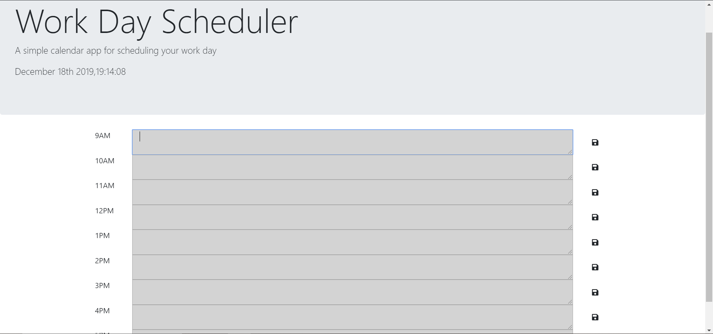
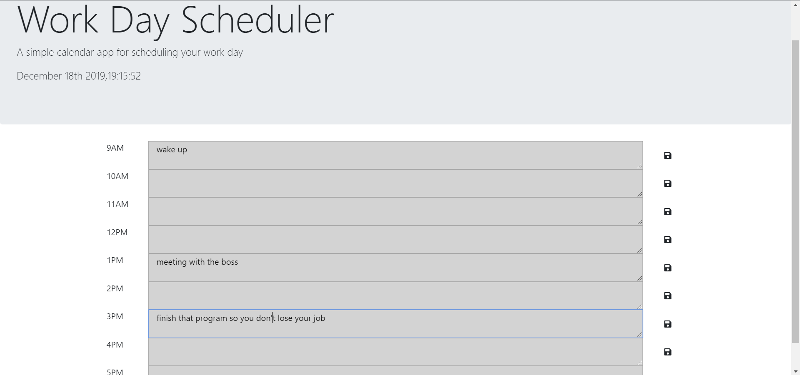

# Daily Work Planner
​
## Overview
​ 
This program is a 9AM-5PM time blick planner that you can use for work days to plan out meetings or anything that you 
might have to do throughout the day. 
The purpose of this application is to ...
​ 
The purpose is to give someone that has a busy day a program that they can use to not only see the time but
to also give them a space that they can write in to keep track of things they need to be doing during the workday. 
They also can easily see what block they are in and the future and past blocks with color changing based on the time
of day. 
### Gallery
​
When First Opened:

​
With Info In Blocks:

​
### Problem
​ 
I ran into the problem of having really long if and else if statements that would do the same thing as the new code I wrote.
Currently ...
​ 
It currenty looks super clean and the code is very short and efficient. 
### Solution
​ 
The solution was to use a jquery .each and it looped trough all of the divs and did the same thing as the super long code. 
My solution will ...
​ 
My solution will make the code so much better to read and it will also make the code much more efficient. 
## Tech and Features Used
​
* Bootstrap
* Javascript
* Jquery
* HTML
​
## How to use
​
When the page loads up you will see the current time and nine different textareas that have a hour block next to them. 
you can put info in the textareas like meeting times, asignment due dates, reminders... When you press the save button
that is to the right of the textarea and it will take that text that you put in there and it saves to localstorage
so that way when you refresh the page or even close the page and open it back up your stuff will still be there. 
If the block is grey that means that the hour has passed, if the block is red that means the block is the current hour, 
and if your block is green that means that those block hours are in the future. 
​
## Technical Overview
​
1. The page opens and loads all the textareas and buttons that you see before you. 
2. When the javascript files loads there will be a time of day that pops up on your page at the top. 
3. You can put info into the textareas and then press the save button if you wanted to save it. 
4. When you press the save button it sets and gets from localstorge on your computer and make the content of the specific
   textarea whatever you saved. 
5. when you close the page you can open the page again and all the same content will be where you left it. 
6. there is a function that will change the color of the textareas to show what time block you are currently in. 
7. if the block is lightGrey then that means that textarea hour has passed. 
8. If the block is red then that means that textarea hour is the current hour. 
9. If the block is green that means that those textarea hours are in the future still. 
